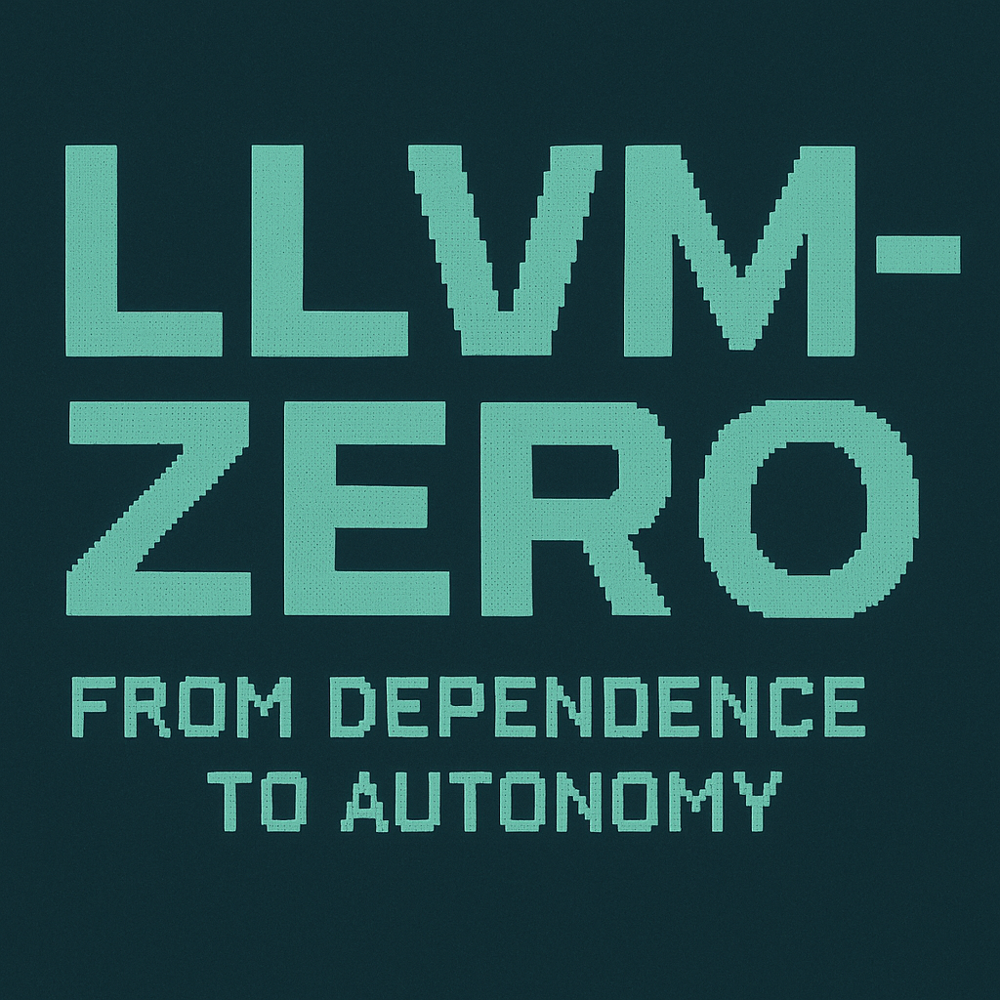

  

# 🧩 LLVM-Zero Ecosystem  
> “The compiler must learn to breathe on its own.”  
> From dependence to autonomy — beyond LLVM.

---

## 🧭 Overview
**LLVM-Zero Ecosystem** is a philosophical and technical framework  
that reimagines compiler design beyond dependency.

It doesn’t deny LLVM’s contribution — it recognizes its limits.  
The project explores how a new generation of compilers  
can evolve toward **autonomy, simplicity, and sovereignty.**

📊 **View Ecosystem Diagram →**  

---

## ⚙️ Core Philosophy
> “Dependence is comfort.  
> Independence is evolution.”

- **Zero-Dependency:** Compilers should no longer rely on monolithic frameworks.  
- **Transparency:** The toolchain must be fully observable and reproducible.  
- **Sustainability:** Simplicity outlasts complexity.  
- **Evolution:** From safety to metal, from metal to freedom.

---

## 🧩 Ecosystem Structure
| Layer | Repository | Role | Status |
|--------|-------------|------|--------|
| 🧱 Core Compiler | [r3c](https://github.com/0200134/r3c) | C++ ↔ Rust transpiler backbone | 🔥 Active |
| ⚙️ LLVM-Zero Framework | (This repo) | Philosophy, documentation, and coordination hub | 🧭 Hub |
| 🦀 Rust-LTSS | [Rust-ltss](https://github.com/0200134/Rust-ltss) | Long-term Rust sustain system | ⏳ Planned |
| 🧩 R3C-nightly-ltss | [R3C-nightly-ltss](https://github.com/0200134/R3C-nightly-ltss) | Experimental nightly compiler line | 🧪 Testing |

---

## 🧾 Goals
- Define a **post-LLVM compiler architecture**  
- Establish a **transparent, LLVM-free build pipeline**  
- Create a **cross-language ABI model** (C++, Rust, ASM)  
- Support **open industrial toolchain research**

---

## 📅 Project Roadmap
| Year | Phase | Description |
|------|--------|-------------|
| 2025 | Philosophy & Docs | Define LLVM-Zero concept, ecosystem structure |
| 2026 | Integration | R3C ↔ LLVM-Zero interoperability research |
| 2027 | Nightly Expansion | Experimental ABI models and open backends |
| 2028 | Compiler Autonomy | LLVM-independent toolchains, CI experiments |
| 2029+ | Industrial Phase | Fully open self-sustaining compiler systems |

---

## 🤝 Collaboration
Contributions are welcome from:
- Compiler researchers  
- Systems engineers  
- Language designers  
- Toolchain maintainers  

Open an issue labeled `[DISCUSSION]` or join our Idea Pool below.

---

## 🧠 Join the LLVM-Zero Idea Pool
> “Ideas are the seeds of independence.”

Got a vision for post-LLVM evolution?  
Want to share ideas about compiler autonomy, zero-dependency infrastructure, or transparent pipelines?  

💡 Contribute your concepts, designs, or compiler experiments in our official discussion space:  
👉 [**LLVM-Zero Idea Pool — 아이디어 수집소**](https://github.com/0200134/LLVM-zero-ecosystem/discussions)

You can:
- Post new proposals (`idea`, `architecture`, `abi`, `ltss`, `philosophy`, etc.)
- Discuss compiler independence and transparency
- Help shape the future of the LLVM-free ecosystem  

🧩 **LLVM-Zero Ecosystem — where dependence ends and autonomy begins.**

---

## 📜 License
**MIT License**  
Free for industrial and research use.

📧 Contact: **0200134hjh@gmail.com**

---

🧩 **LLVM-Zero Ecosystem — “From dependence to autonomy.”**  
> Compilers evolve. Frameworks fade.  
> But clarity — remains.
